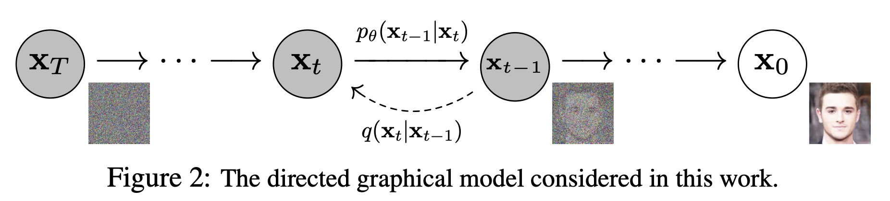

# Week 10. Generative Advanced

## Generative Adversarial Network (GAN)
### Architecture

두 개의 multi-layer perceptron model로 이루어진 network

* Generative model $G$: data distribution을 최대한 따르도록 sample 생성
  * Discriminative model $D$가 판단 실수를 하도록($G$에서 나온 sample을 실제 data로 착각하도록) 하는 확률을 최대화하도록 학습
* Discriminative model $D$: sample이 실제 data에서 나온 것인지, generative model $G$에서 나온 것인지 판단

### Training process

$$\min_{G} \max_{D} V(D, G) = \mathbb{E}_{x \sim p_{data}(x)}{[\log{D(x)}]} + \mathbb{E}_{z \sim p_z (z)} [\log{(1 - D(G(z)))}]$$

GAN은

* 실제 data인 $x$를 discriminator $D$가 정말로 실제 data라고 판단할 확률 $D(x)$과
* Noise $z$를 가지고 generator $G$가 만들어 낸 가짜 data $G(z)$를 discriminator $D$가 실제 data가 아니라고 (=가짜라고) 판단할 확률 $1-D(G(z))$의 합을
* Generator $G$는 최소화하도록 ($-\infin$)
  * $D(G(z))$가 1에 가까워지도록 해야하기 때문
* Discriminator $D$는 최대화하도록 (0에 가깝도록)
  * $D(x)$가 1에 가까워지도록, $D(G(z))$는 0에 가까워지도록 해야하기 때문

학습합니다.

## Variational Autoencoder (VAE)

### Architecture

* Encoder-decoder 구조
* Encoder $e_\theta$: input을 latent vector로 변환
* Decoder $d_\phi$: encoder로부터 나온 latent vector를 가지고, input을 재구성(복원)

### Training process

$$p_\theta (x) = \int p_\theta (z) p_\theta (x | z) dz$$

VAE는

* Decoder로부터 input $x$ (= decoder 출력의 ground truth) 가 나올 확률이 높아지도록
    * Bayesian에 따라 $\frac{p_\theta (x | z)p_\theta (z)}{p_\theta (z | x)}$가 커지도록

학습됩니다.

## Flow-based model

### Architecture

* Flow $f$: input을 latent vector로 변환
* Inverse $f^{-1}$: latent vector를 input으로 복원하는 역변환

⚠️ Inverse 단계에서 역변환이 가능해야하기 때문에, Flow는 가역변환이어야 합니다.

## Diffusion

### Architecture

* Forward process $p$: input에 noise를 포함하여 생성 
* Reverse process $q$: noise를 포함한 forward process의 결과를 복원