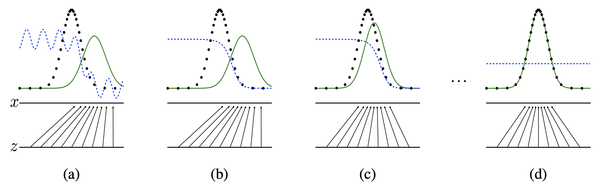
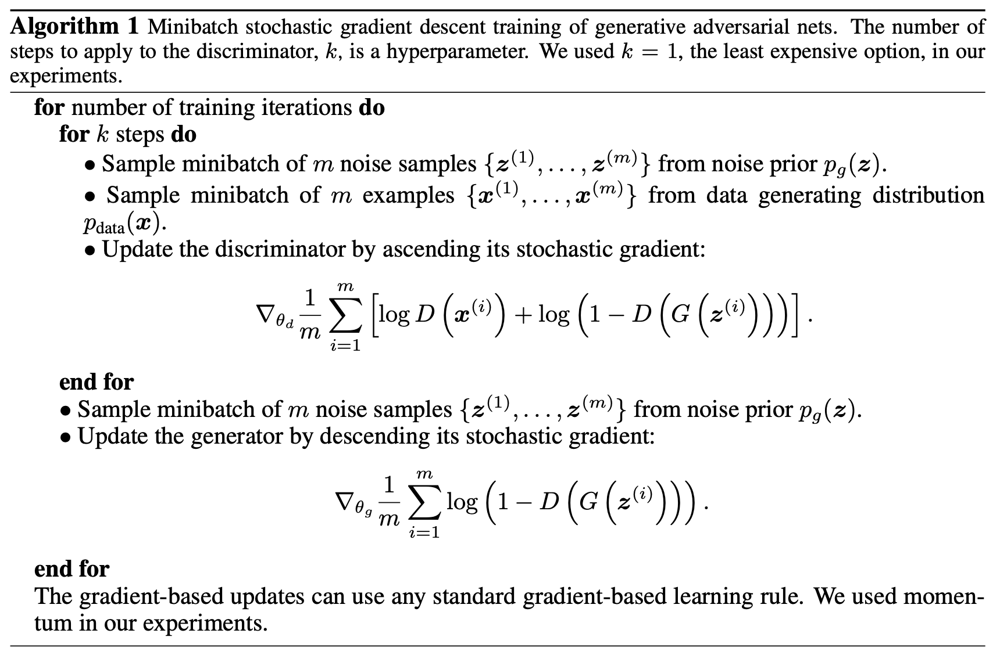

# Week 9. Generative Basic

## Abstract
* Generative model $G$: data distribution을 최대한 따르도록 sample 생성
  * Discriminative model $D$가 판단 실수를 하도록($G$에서 나온 sample을 실제 data로 착각하도록) 하는 확률을 최대화하도록 학습
* Discriminative model $D$: sample이 실제 data에서 나온 것인지, generative model $G$에서 나온 것인지 판단

## 1. Introduction
### Adversarial net
두 개의 multi-layer perceptron model로 이루어진 network

* Discriminative model $D$: sample이 model distribution(실제가 아님, generative model $G$에서 생성된 가짜)에서 나온 것인지 data distribution(실제 data)에서 나온 것인지 잘 판단하도록 학습
* Generative model $G$: discriminative model $D$가 알아채지 못하도록 sample 생성

➡️ Model이 만들어낸 것과 실제 data를 구분하지 못할 정도의 sample을 generator가 생성하도록 두 model 모두 발전

## 3. Adversarial nets
### Training process

$$\min_{G} \max_{D} V(D, G) = \mathbb{E}_{x \sim p_{data}(x)}{[\log{D(x)}]} + \mathbb{E}_{z \sim p_z (z)} [\log{(1 - D(G(z)))}]$$

* 실제 data인 $x$를 discriminator $D$가 정말로 실제 data라고 판단할 확률 $D(x)$과
* Noise $z$를 가지고 generator $G$가 만들어 낸 가짜 data $G(z)$를 discriminator $D$가 실제 data가 아니라고 (=가짜라고) 판단할 확률 $1-D(G(z))$의 합을
* Generator $G$는 최소화하도록 ($-\infin$)
  * $D(G(z))$가 1에 가까워지도록 해야하기 때문
* Discriminator $D$는 최대화하도록 (0에 가깝도록)
  * $D(x)$가 1에 가까워지도록, $D(G(z))$는 0에 가까워지도록 해야하기 때문

학습합니다.

### Theoretical analysis

* 🟦: Discriminator $D$가 실제와 가짜를 구분하는 discriminative distribution
* ⚫️: 실제 data distribution
* 🟩: Generator $G$가 만드는 generative distribution (가짜)

(a) Generator도, discriminator도 충분히 학습되지 않은 상태
* 실제 data distribution과 generative distribution이 차이가 남
* Discriminator도 둘을 아직 정확히 분류하지는 못하고 있음

(b) Discriminator를 학습시키고 있는 상태
* 실제 data distribution과 generative distribution을 구분하도록 선이 그어지고 있음

(c) Generator를 학습시키고 있는 상태
* 실제 data distribution과 비슷한 generative distribution가 비슷하도록

(d) Generator가 충분히 학습된 상태
* 실제 data distribution $p_x$와 generative distribution $p_g$가 매우 유사
* discriminator가 실제와 가짜를 구분할 수 없음

👎 Discriminator $D$를 학습시키기 위해서는 너무 많은 연산이 필요함 \
👎 Discriminator $D$를 학습시키는 과정에서 overfitting이 일어날 가능성이 높음 \
👎 Discriminator $D$가 처음부터 generator $G$가 만드는 sample을 너무 잘 구분해서, 더이상 학습이 이루어지지 않을 수 있음

🛠 Discriminator $D$는 $k$ steps, generator $G$는 one step을 학습하도록 함
